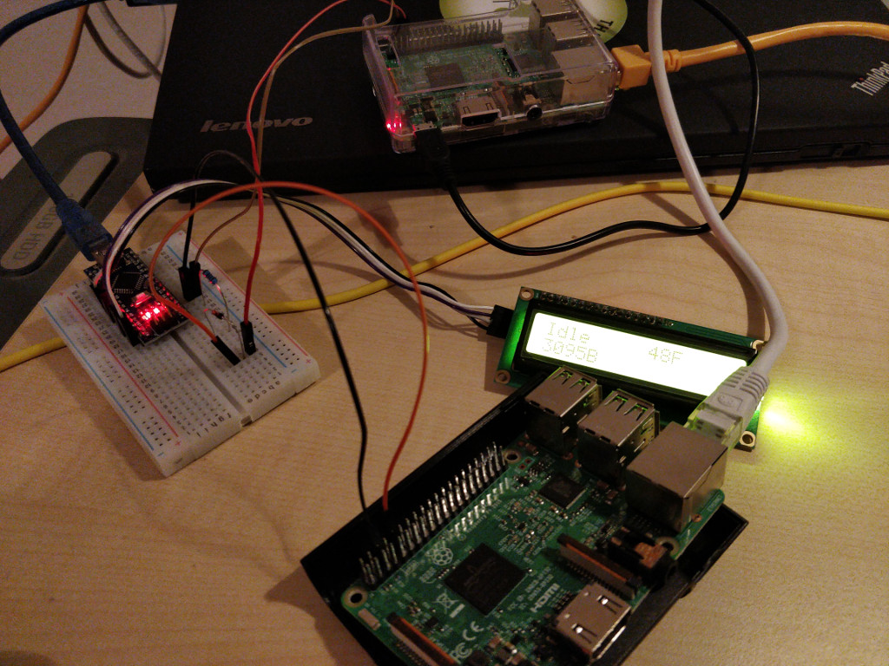
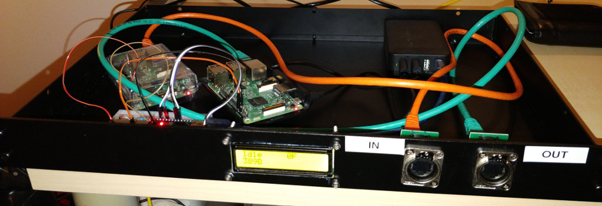

# About
This project contains the source code for a DIY data diode. It uses
Raspberry Pis to transmit data via the serial interface from one to
the other. An Arduino device can be used to monitor the traffic and
show the status on an 1602 LCD.


# Installation
1) Install any OS that supports Python3 on the Raspberry Pis
2) Move the scripts in the ```bin``` directory to ```/usr/bin/```
3) Move the service files from ```systemd``` to
   ```/etc/systemd/system```
4) Flash the SerialMonitor.ino to an Arduino.
5) Connect the Grounds of both Raspberry Pis and the Arduino
6) Connect the Tx of one Raspberry Pi with the Rx of the other Pi and
   the Arduino. If required, place a diode between the Tx and the Rx
   pins.
  
7) Reload the systemd configuration on the Raspberry Pis with
   ```systemctl daemon-reload```. On the Pi that is transmitting,
   run ```systemctl enable diode-send.service```. On the other run
   ```systemctl enable diode-receive.service```.
8) On both Pis start ```raspi-config```, select
   ```Interfacing Options```, and then ```Serial```.
   Disable the login shell via serial and enable the hardware port.
9) On the sending Pi, create a user ```sender``` and then run
   ```mkdir /home/sender/diode-send/```. On the receiving Pi, create
   a user ```receiver``` and run
   ```mkdir /home/receiver/diode-receive```.
10) Reboot the Pis.
11) If you ```scp``` a file to ```/home/sender/diode-send```, you
    should be able to pick it up from
    ```/home/receiver/diode-receive``` a little while later.

# Required Parts
* 2x Raspberry Pi
* 1x Arduino
* 1x 1602 LCD with I2C
* 1x Diode
## Optional
* 1x USB power supply with 3 outlets
* 1x large enough case to house everything
* 2x RJ45 feedthroughs (i.e. Neutrik NE8FDP)





