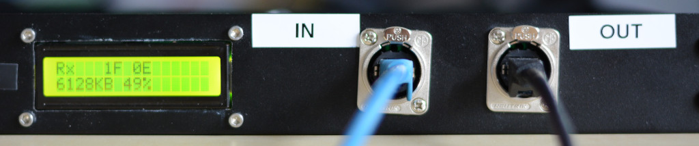
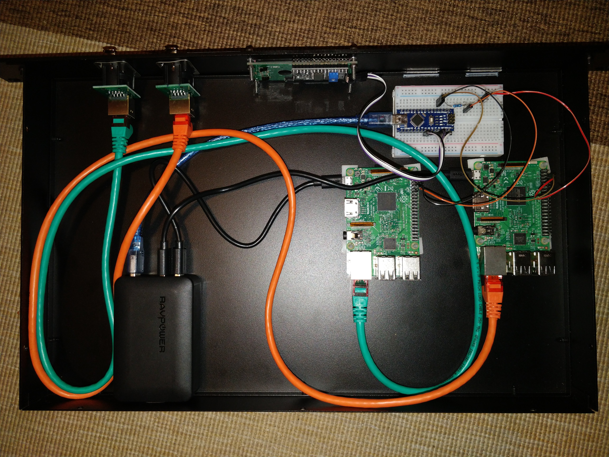

## About
This project contains the source code for a DIY data diode. It uses
Raspberry Pis to unidirectionally transmit files via UDP through a
single fiber optics cable without a back channel. An Arduino can be
used to monitor the traffic and show the status on a 1602 LCD.

The software is primarily developed for OpenBSD but will also work
on Raspbian or Debian. OpenBSD seems better suited as it is easier
to maintain a mirror repository of the core operating system and
selected packages. This project therefore includes a program to
download OpenBSD packages with their dependencies for transferral
through the diode. They can then be served from a webserver in the
internal network.

Version 3 of this build is based on
[Vrolijk/OSDD](https://github.com/Vrolijk/OSDD).

I recommend to also look into 
[wavestone-cdt/dyode](https://github.com/wavestone-cdt/dyode),
which is a very similar project.

## How it works
The sending Raspberry Pi continuously checks a directory for new files.
Files can be dropped into this directory with any protocol. If a new
file is detected, it will be split into chunks, which will then be
transferred through the unidirectional fiber cable. In the end, a hash
sum is transferred as well. If the hash of the transferred data matches
the sent hash, the received file will be stored in a target directory of
the receiving Raspberry Pi, ready for pick up. If the hashes do not
match, the error counter on the display increases by one.

The display shows the status of the diode (idle/transfer in progress),
the total number of files transferred, the number of errors that
occured, the total amount of transferred KB, and the progress
(percentage) of the current file transfer.

In a previous version a Serial connection was used. Check out the 
[`v2.3`](https://github.com/svenseeberg/data-diode/releases/tag/v2.3)
tag for the Serial version.

## Speed
The speed of the diode is mostly limited by the UART devices. A data rate
of about 5 MB/s can be achieved. This is fast enough to keep a mirror of
OpenBSD with a selected subset of packages up to date in an internal
network.

## Security
There are some serious limitations to the concept of the diode and the
mystical [air gap](https://cyber.bgu.ac.il/air-gap/). Beyond that all
security caveats apply.

## Installation instructions
For details about the installation, read [INSTALL.md](INSTALL.md). For
instructions about updating the OpenBSD release, read
[UPDATE.md](UPDATE.md). The UPDATE.md also documents how to set up and
maintain/sync an OpenBSD mirror in the internal network.

Compatible OpenBSD versions: 7.2 to 7.5

## Required Hardware
* 2x Raspberry Pi 4B
* 2x TP-LINK MC200CM Gigabit Ethernet converter
* 2x USB Gigabit Ethernet adapters (use ASIX AX88179 chipset for OpenBSD support)
* 1x Fiber Optical Splitter 1x2 PLC SC/UPC PCL Splitter
* 2x USB-C cables
* 1x USB power supply with 2 outlets

## Optional Hardware
* 1x Arduino including USB cable
* 1x 1602 LCD with I2C
* 1x Optocoupler or diode + resistor
* 1x large enough case to house everything
* 2x RJ45 feedthroughs (i.e. Neutrik NE8FDP)

