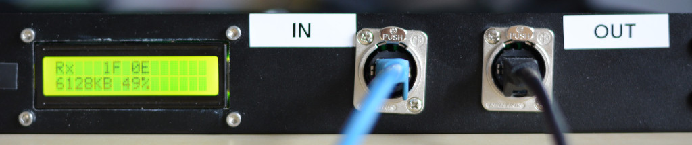
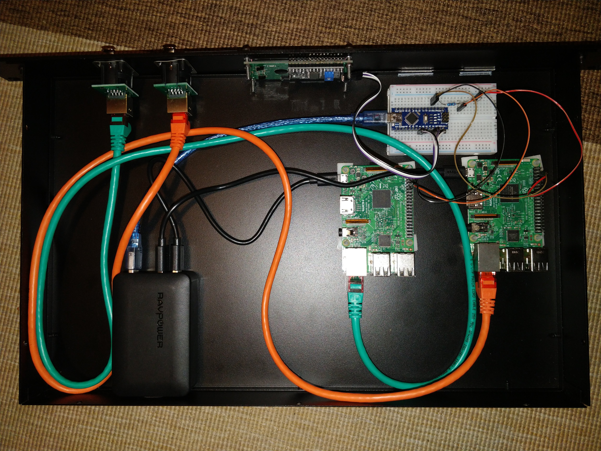

## About
This project is an OpenBSD-targeted, Rust-based
[data diode](https://en.wikipedia.org/wiki/Unidirectional_network)
intended to be deployed on two Raspberry Pis. It transmits files
via UDP through a fiber optics cable without a back channel. An
Arduino can be used to monitor the traffic and show the status on
a 1602 LCD.



The software is primarily developed for OpenBSD but will also work
on Raspbian or Debian. OpenBSD seems better suited as it is easier
to maintain a mirror repository of the core operating system and
selected packages. This project therefore includes a program to
download OpenBSD packages with their dependencies for transferral
through the diode. They can then be served from a webserver in the
internal network.

Version 3 of this build is based on
[Vrolijk/OSDD](https://github.com/Vrolijk/OSDD). I recommend to also
look into [wavestone-cdt/dyode](https://github.com/wavestone-cdt/dyode),
which is a very similar project.

## How it works
The sending Raspberry Pi continuously checks a directory for new files.
Files can be dropped into this directory with any protocol. If a new
file is detected, it will transferred through the unidirectional fiber
cable. In the end, a hash sum is transferred as well. If the hash of the
transferred data matches the sent hash, the received file will be stored
in a target directory of the receiving Raspberry Pi, ready for pick up.
If the hashes do not match, the error counter on the display increases
by one. Additionally, an empty file with the same filename and the ending
`.failed` will be created.

The display shows the status of the diode (idle/transfer in progress),
the total number of files transferred, the number of errors that
occured, the total amount of transferred KB, and the progress
(percentage) of the current file transfer.

In addition to transferring files, the sender can be configured to
listen for incoming UDP packets on a specified port. The receiver
can be configured to forward these UDP packets to a specified IP
address and port in the internal network.

In a previous version a Serial connection was used. Check out the 
[`v2.3`](https://github.com/svenseeberg/data-diode/releases/tag/v2.3)
tag for the Serial version.

## Speed and Error Rate
The speed of the diode is mostly limited by CPU or the SD card. A data
rate of about 5 to 10 MB/s can be achieved. This is fast enough to keep
a mirror of OpenBSD with a selected subset of packages up to date in an
internal network.

Depending on the configured speed, some packets are lost. To mitigate this
problem, the sender adds Reed-Solomon forward error correction (FEC) parity
packets after every batch of 1000 data chunks (100 parity shards per batch).
The receiver buffers one batch at a time, reconstructs any missing data
chunks from the parity shards, and writes the batch to disk as soon as the
next batch begins. Neither side has to hold a full file in memory, so FEC
applies regardless of file size.

START and END control packets are transmitted multiple times to survive
single-packet loss without falling back to FEC.

To avoid having to re-transmit large files, which is in turn is again
error-prone, chunking large files before transmitting is
possible with the `bin/split_files` script. The `bin/merge_files` script
can re-assemble the original files on the receiving Pi. The scripts use
`sha256` to validate the transferred files.

## Security model

Basic caveat: There are some serious limitations to the concept of the diode
and the mystical [air gap](https://cyber.bgu.ac.il/air-gap/).

The receiver is the trust boundary for the air-gapped internal network.
Because UDP is unauthenticated, *any* sender on the fiber line can reach the
receiver — both the intended diode-side peer and anyone with physical access
to the link (or the sender-side NIC). The receiver therefore treats every
incoming packet as adversarial by default:

1. **Path-traversal rejection.** A START packet names the local file to create.
   `is_safe_rel_path()` (in `diode_common`) rejects absolute paths, `..`
   components, NUL bytes and Windows-style roots before the path is joined
   onto the output directory. Any violation causes the transfer to be dropped
   and a `.failed` marker to be written.
2. **Payload-size policy.** DATA chunks must be 1..=CHUNK_SIZE (940 bytes)
   and PARITY shards must be exactly SHARD_SIZE (960 bytes). Anything else is
   silently dropped before it reaches the per-batch buffer, which prevents
   an attacker from forcing the 8 MB batch cap by smuggling 65 KB UDP-sized
   "data" chunks in.
3. **UDP-forward cap.** Reassembled UDP payloads are capped at
   `UDP_MAX_FORWARD_BYTES` (4 MiB). The size field is pinned at flow start
   so a mid-flow rewrite cannot truncate or extend the reassembled datagram
   before it reaches the internal host. Flows that exceed the cap or whose
   fragments do not line up are dropped without being forwarded.
4. **Per-batch memory cap.** Buffered data + parity is hard-capped at
   `BUFFER_BYTE_LIMIT` (8 MiB) per batch; the buffer is cleared on batch
   flip and on reset, and counters use saturating arithmetic so a release-
   mode overflow cannot wrap into the next allocation.
5. **Lock-poisoning recovery.** If a handler ever panics while holding the
   worker mutex (e.g. an OOM in the FEC decoder), the worker recovers the
   poisoned guard, marks the in-flight transfer as failed, and continues
   rather than turning one pathological packet into a persistent DoS.
6. **Log sanitization.** String fields that originate from a remote START
   payload (chiefly the file path) are sanitized through `log_safe()` before
   they are interpolated into `log::!` macros, so they cannot inject control
   characters into a human-readable console or syslog capture.
7. **Strong integrity digest.** On success, the receiver computes the
   SHA-256 of the finalized output file and writes it to the log. The
   per-chunk MD5 on the wire only defeats bit-flips; the digest is what
   protects against silent FEC reconstruction with attacker-influenced parity
   shards. `bin/merge_files` independently verifies large reassembled files
   against the SHA256 manifest written by `bin/split_files`.

The sender-side `diode_send` deletes each file after the END packet has been
transmitted. If the END is lost (possible: it is retransmitted only 3 times
and there is no ACK over a diode), there is a narrow window in which the
sender has deleted a file whose transfer may not have completed at the
receiver. On loss, the receiver will emit `Failed to rename` and a
`<name>.failed` marker will appear; the operator then has to re-push the
file.

The diode as a system remains a physical unidirectional channel, but the
receiver's input surface is software, and these mitigations assume an
attacker who can *write* arbitrary bytes to the receiver's UDP socket.

## Building from source
The workspace contains three crates: `diode_common` (shared logging, MD5
helper, wire-format constants and helpers), `diode_send`, and
`diode_receive`. A stable Rust toolchain (`cargo`) is required.

```bash
# Build both binaries in release mode
cargo build --release

# Build the receiver with Arduino LCD support
cargo build --release --features arduino --package diode-receive
```

The resulting binaries are placed in `target/release/diode_send` and
`target/release/diode_receive`.

### Running locally

```bash
# Sender
cargo run --release --bin diode_send -- \
    --directory /path/to/send \
    --target-subnet 10.125.125.255 \
    --target-port 5005

# Receiver (without Arduino)
cargo run --release --bin diode_receive -- \
    --directory /path/to/receive \
    --bind-subnet 10.125.125.255 \
    --bind-port 5005

# Receiver (with Arduino LCD on /dev/cuaU0)
cargo run --release --features arduino --bin diode_receive -- \
    --directory /path/to/receive \
    --bind-subnet 10.125.125.255 \
    --bind-port 5005 \
    --arduino /dev/cuaU0
```

UDP forwarding through the diode is enabled by passing `--udp-port` on the
sender and `--udp-target-port`/`--udp-target-ip` on the receiver.

## Installation instructions
For details about the installation, read [INSTALL.md](INSTALL.md). For
instructions about updating the OpenBSD release, read
[UPDATE.md](UPDATE.md). The UPDATE.md also documents how to set up and
maintain/sync an OpenBSD mirror in the internal network.

Compatible OpenBSD versions: 7.2 to 7.9.

## Required Hardware
* 2x Raspberry Pi 4B
* 2x TP-LINK MC200CM Gigabit Ethernet converter
* 2x USB Gigabit Ethernet adapters (use ASIX AX88179 chipset for OpenBSD support)
* 1x Fiber Optical Splitter 1x2 PLC SC/UPC PCL Splitter
* 2x USB-C cables
* 1x USB power supply with 2 outlets

## Optional Hardware
* 1x Arduino including USB cable
* 1x 1602 LCD with I2C
* 1x large enough case to house everything
* 2x RJ45 feedthroughs (i.e. Neutrik NE8FDP)


