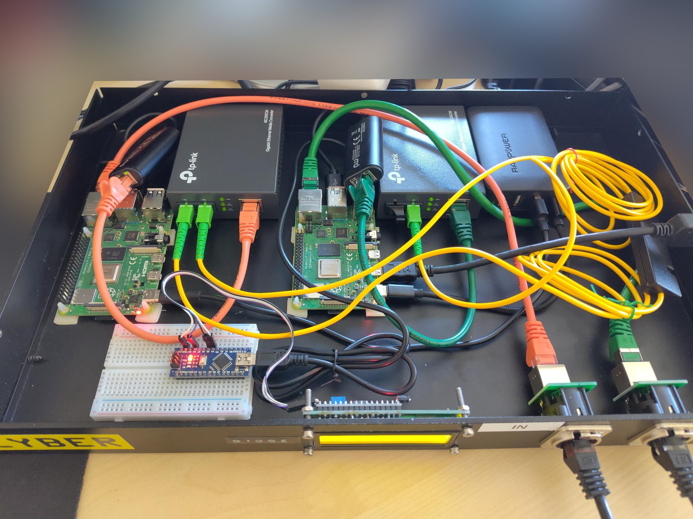

## About
This project contains the source code for a DIY data diode. It uses
Raspberry Pis to unidirectionally transmit data via the serial
interface from one to the other. As the reverse direction pins are
not connected, no transfer in the other direction is possible. An
Arduino can be used to monitor the traffic and show the status on
a 1602 LCD.

The software is primarily developed for OpenBSD but will also work
on Raspbian or Debian. OpenBSD seems better suited as it is easier
to maintain a mirror repository of the core operating system and
selected packages. A simple script to download the required files
and copy them through the diode is included.

I recommend to also look into 
[wavestone-cdt/dyode](https://github.com/wavestone-cdt/dyode),
which is a very similar project.

## How it works
The sending Raspberry Pi continuously checks a directory for new files.
Files can be dropped into this directory with any protocol. If a new
file is detected, it will be split into chunks, which will then be
transferred through the unidirectional serial wire. In the end, a hash
sum is transferred as well. If the hash of the transferred data matches
the sent hash, the received file will be stored in a target directory of
the receiving Raspberry Pi, ready for pick up. If the hashes do not
match, the error counter on the display increases by one.

The display shows the status of the diode (idle/transfer in progress),
the total number of files transferred, the number of errors that
occured, the total amount of transferred KB, and the progress
(percentage) of the current file transfer.

This project also includes a program to download OpenBSD packages with
their dependencies for transferral through the diode. They can then be
served from a webserver in the internal network.

## Speed
The speed of the diode is mostly limited by the UART devices. With cheap
USB UART adapters, a data rate of about 20KB/s can be achieved. This is
fast enough to keep a mirror of OpenBSD with a selected subset of
packages up to date in an internal network.

## Security
There are some serious limitations to the concept of the diode and the
mystical air gap when using Raspberry Pis (and probably (m)any other
devices). Therefore, the security mainly hinges on the integrity of the
operating system on the receiving Pi. The main advantage in this setup
is that there is no default bidrectional communication. And the
interactive use of the receiving Pi is very limited (receiving files via
serial communication and writing them to the file system & updating the
operating system frequently). This should make it a little more
difficult for an attacker to gain control of the device. However, if the
receiving device is compromized, there are probably lots of channels for
bidrectional communication. I can think of a few examples, which could
potentially be used. And I'm not even taking computers/devices into
account that are connected to the receiving Pi in the internal network.
* The power management integrated circuit (MxL7704) has a I2C connection
to the SoC. Therefore an attacker might be able to use this device and
monitor the supply voltage, which could potentially be manipulated by
the power consumption of the other Pi, if both use the same power
supply.
* Even if the WLAN and bluetooth antenna is disconnected, a stub
antenna still remains. I would not be surprised if it is possible to use
this for short range communication.
* There are many projects that use the GPIO clock pins for transmitting radio
signals, usually with an attached antenna. And at least the audio jack
is basically an AD converter.
## Installation instructions
For details about the installation, read [INSTALL.md](INSTALL.md).

## Required Hardware
* 2x Raspberry Pi 4B
* 2x USB UART serial adapters
* 2x USB-C cables
* 2x female-female jumper wires
* 1x USB power supply with 2 outlets

## Optional Hardware
* 1x Arduino including USB cable
* 1x 1602 LCD with I2C
* 1x Optocoupler or diode + resistor
* 1x large enough case to house everything
* 2x RJ45 feedthroughs (i.e. Neutrik NE8FDP)

